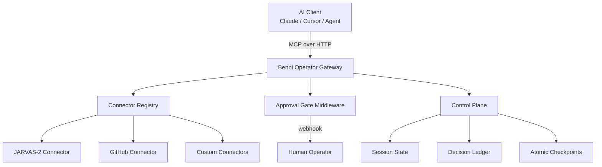

# Benni Operator Gateway

> **Open Source MCP Gateway for AI Operators** — connect any LLM to your autonomous agent stack with production-grade approval gates, hot-reload connector registry, and a built-in Control Plane.

[](LICENSE)
[](https://www.typescriptlang.org/)
[](https://nodejs.org/)
[](CONTRIBUTING.md)

---

## What is this?

**Benni Operator Gateway** is the open source core of the **Benni OS** autonomous AI operator stack. It implements the [Model Context Protocol (MCP)](https://modelcontextprotocol.io/) as a production-grade HTTP gateway — letting any MCP-compatible AI client (Claude Desktop, Cursor, custom agents) connect to a unified, extensible set of tools and connectors.

Built for AI builders who want:
- A **self-hosted alternative** to managed tool-calling APIs
- **Full control** over what tools their agents can access
- **Human-in-the-loop approval gates** before sensitive actions execute
- A **connector registry** that hot-reloads without downtime

---

## Architecture



---

## Quick Start

```bash
# 1. Clone
git clone https://github.com/benni-os/benni-operator-gateway
cd benni-operator-gateway

# 2. Install
npm install

# 3. Configure
cp .env.example .env
# Edit .env with your API keys

# 4. Run
npm run dev
```

Your MCP gateway is now live at `http://localhost:3000`.

---

## Built-in Connectors

| Connector | Status | Description |
|---|---|---|
| `jarvas2` | ✅ Stable | JARVAS-2 autonomous agent — run tasks, queue jobs, set objectives |
| `github` | ✅ Stable | Full GitHub API via MCP — issues, PRs, code, reviews |
| `control-plane` | 🔧 Beta | Session state, atomic checkpoints, decision ledger |

---

## Project Structure

```
src/
├── app.ts               # Server bootstrap
├── index.ts             # Entrypoint
├── config/              # Environment & provider config
├── connectors/          # MCP connector modules
│   ├── jarvas2/         # JARVAS-2 connector
│   └── github/          # GitHub MCP connector
├── lib/                 # Core utilities
├── middleware/          # Auth, approval gate, rate limiting
├── registry/            # Hot-reload connector registry
├── routes/              # HTTP endpoints
├── services/            # LLM dispatch, session management
└── types/               # TypeScript contracts
```

---

## Approval Gate

The gateway includes a built-in **human approval middleware** that intercepts sensitive tool calls before execution:

```typescript
// Any tool marked requires_approval: true will pause and
// send a webhook to your configured APPROVAL_WEBHOOK_URL
// before proceeding. The agent waits for your response.

{
  "action": "delete_production_database",
  "reason": "Cleanup task requested by agent",
  "payload": { ... },
  "approve_url": "https://your-gateway/approve/req_abc123",
  "reject_url": "https://your-gateway/reject/req_abc123"
}
```

---

## Roadmap

- [x] MCP HTTP gateway core
- [x] JARVAS-2 connector
- [x] GitHub connector
- [x] Human approval gate
- [ ] npm package `@benni-os/operator-gateway`
- [ ] Control Plane SDK
- [ ] Docker image + one-click Railway/Render deploy
- [ ] Web dashboard (runs + decisions + health)
- [ ] Benni OS Cloud (hosted)

---

## Contributing

See [CONTRIBUTING.md](CONTRIBUTING.md). All connector contributions welcome.

---

## Part of Benni OS

This gateway is the open source foundation of **Benni OS** — a full autonomous AI operator stack. Follow the project:

- GitHub Org: [github.com/benni-os](https://github.com/benni-os)
- Built by [Benni Alencar](https://github.com/nsfwbunny)

---

**MIT License** — use freely, contribute back.
