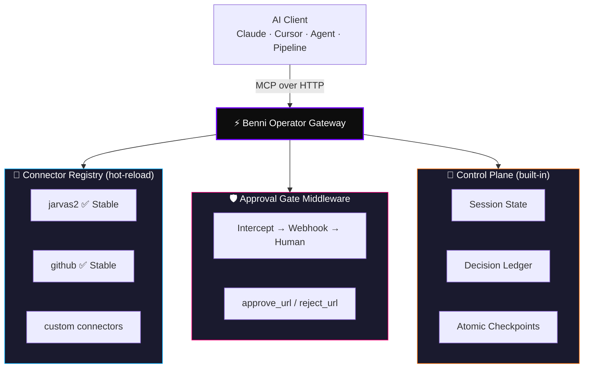

<div align="center">


<br/>


<br/><br/>

[](LICENSE)
[](https://www.typescriptlang.org/)
[](https://nodejs.org/)
[](https://modelcontextprotocol.io/)
[](CONTRIBUTING.md)
[](https://github.com/benni-os)

<br/>

> **"You need a gate, not a rubber stamp."**


</div>

<br/>

## ⭐ What Is Benni Operator Gateway?

**Benni Operator Gateway** is the open-source MCP infrastructure layer of the **[Benni OS](https://github.com/benni-os)** ecosystem — a production-grade HTTP gateway implementing the [Model Context Protocol](https://modelcontextprotocol.io/), purpose-built for autonomous AI operators.

It gives any MCP-compatible client (Claude Desktop, Cursor, custom agents, CI pipelines) a single, secure, extensible interface to interact with your tools, services, and data — without surrendering control to third-party managed APIs.

```
INTENTION → AI CLIENT → MCP OVER HTTP → OPERATOR GATEWAY → APPROVAL GATE → EXECUTION → AUDIT LOG
```

<br/>


## ⚡ Core Doctrine

> These are not settings. These are architecture laws.

| ☔ Principle | 🔧 Implementation |
|---|---|
| **Gate, Not Rubber Stamp** | Every sensitive action is intercepted — agent pauses, human approves, then execution resumes |
| **Hot-Reload Registry** | Add or remove connectors live — zero downtime, zero redeploy |
| **Decision Ledger** | Every tool dispatch logged with full context — tamper-evident, append-only |
| **Provider-Agnostic** | Route any LLM behind one interface — no lock-in, no vendor dependency |
| **Session Continuity** | Built-in Control Plane persists state and atomic checkpoints across agent runs |
| **Open Core** | Gateway is, and will remain, fully MIT — build on it, fork it, contribute back |

<br/>


## 🏗️ Architecture



<br/>


## 🚀 Quick Start

```bash
# 1. Clone
git clone https://github.com/benni-os/benni-operator-gateway
cd benni-operator-gateway

# 2. Install
npm install

# 3. Configure
cp .env.example .env
# Edit .env — set GATEWAY_API_KEY, APPROVAL_WEBHOOK_URL, GITHUB_TOKEN

# 4. Run (development)
npm run dev

# 4b. Run (production)
npm run build && npm start
```

Your MCP gateway is live at `http://localhost:3000`.
Point any MCP-compatible client to `http://localhost:3000/mcp`.

<br/>


## 🔌 Built-in Connectors

| Connector | Status | Description |
|---|---|---|
| `jarvas2` | ✅ Stable | JARVAS-2 agent runtime — dispatch tasks, queue jobs, set objectives, read operational memory |
| `github` | ✅ Stable | Full GitHub API surface — issues, PRs, code search, reviews, branch management, secret scanning |
| `control-plane` | 🔧 Beta | Gateway-native session state, atomic checkpoints, decision ledger — no external dependency |

> The gateway is fully functional as a standalone MCP gateway. JARVAS-2 and Benni Control Plane are optional — connect any agent backend or build your own connector.

<br/>


## 🛡️ Approval Gate

The built-in **human-in-the-loop middleware** intercepts any tool call marked `requires_approval: true`. The agent pauses, your webhook fires, nothing executes until you approve or reject.

```typescript
// Payload sent to APPROVAL_WEBHOOK_URL
{
  "action": "deploy_to_production",
  "reason": "Agent requested deployment after build passed",
  "payload": { ... },
  "approve_url": "https://your-gateway/approve/req_abc123",
  "reject_url":  "https://your-gateway/reject/req_abc123"
}
```

**Pause → Notify → Resume.** The core safety primitive for running agents against real infrastructure.

<br/>


## ⚙️ Configuration

```bash
# Server
PORT=3000
NODE_ENV=production

# Auth
GATEWAY_API_KEY=your_secret_key

# Approval Gate
APPROVAL_WEBHOOK_URL=https://your-endpoint/approval
APPROVAL_TIMEOUT_MS=300000  # 5 minutes

# JARVAS-2 Connector (optional)
JARVAS2_API_URL=https://your-jarvas2-instance
JARVAS2_API_KEY=your_jarvas2_key

# GitHub Connector
GITHUB_TOKEN=your_github_pat
```

<br/>


## 📁 Project Structure

```
src/
├── app.ts               # Server bootstrap
├── index.ts             # Entrypoint
├── config/              # Environment & provider config
├── connectors/          # MCP connector modules
│   ├── jarvas2/         # JARVAS-2 connector
│   └── github/          # GitHub MCP connector
├── middleware/          # Auth, approval gate, rate limiting
├── registry/            # Hot-reload connector registry
├── routes/              # HTTP endpoints
├── services/            # LLM dispatch, session management
└── types/               # TypeScript contracts
```

<br/>


## 🚢 Deployment

```bash
# Docker
docker build -t benni-operator-gateway .
docker run -p 3000:3000 --env-file .env benni-operator-gateway

# Fly.io (fly.toml included)
fly deploy

# Any VPS / cloud VM
npm run build && npm start
```

<br/>


## 🗺️ Roadmap

- [x] MCP HTTP gateway core
- [x] JARVAS-2 connector
- [x] GitHub connector
- [x] Human approval gate
- [x] Built-in Control Plane (session state, ledger, checkpoints)
- [ ] npm package `@benni-os/operator-gateway`
- [ ] Docker image + one-click Railway / Render deploy
- [ ] Web dashboard (runs · decisions · health)
- [ ] Plugin SDK for custom connector development
- [ ] OpenTelemetry tracing integration
- [ ] Multi-tenant workspace isolation

<br/>


## 🤝 Contributing

Contributions welcome — especially new connectors. See [CONTRIBUTING.md](CONTRIBUTING.md).

Highest-value contributions right now:
- New MCP connectors (Notion, Linear, Slack, Supabase, etc.)
- Improved approval gate delivery (email, Telegram, SMS)
- Docker Compose + one-click deploy configurations
- Observability integrations (OpenTelemetry, Grafana)

<br/>


## 🌐 Benni OS Ecosystem

| Product | Repo | Role | Status |
|---|---|---|---|
| 🧠 **Benni Master OS** | [benni-os/Benni-Master-OS](https://github.com/benni-os/Benni-Master-OS) | General Brain — sovereign orchestrator | 🟢 Live |
| ⚡ **Benni Gravity** | [benni-os/Benni-gravity-0](https://github.com/benni-os/Benni-gravity-0) | Local operator runtime — agents, revenue, content | 🟢 Ativo |
| 🔌 **Operator Gateway** | [benni-os/benni-operator-gateway](https://github.com/benni-os/benni-operator-gateway) | Open-source MCP gateway — you are here | 🟢 MIT |
| 🐍 **mcp-forge** | [benni-os/mcp-forge](https://github.com/benni-os/mcp-forge) | FastAPI-style Python MCP framework | 🟢 PyPI |
| ⚡ **benni-nexus** | [benni-os/benni-nexus](https://github.com/benni-os/benni-nexus) | LLM gateway — route, balance, observe | 🟢 npm |
| 🛠️ **Benni Control Plane** | MCP on Railway | NEXUS v5 — persistent memory layer | 🟢 Railway |
| 🤖 **JARVAS-2** | [benni-os/jarvas-2](https://github.com/benni-os/jarvas-2) | Autonomous dispatch + Wave 6 billing | 🔥 Hot |
| 🛍️ **Modo Operador** | [benni-os/modo-operador](https://github.com/benni-os/modo-operador) | Produto BR — R$97 | 🟢 Live |

<br/>


<div align="center">

**BENNI OPERATOR GATEWAY** — *Open-Source MCP Infrastructure by [Benni OS](https://github.com/benni-os)*

`MIT_LICENSE` • `APPROVAL_GATE` • `HOT_RELOAD` • `DECISION_LEDGER` • `ZERO_VENDOR_LOCK`

Built by [Benni Alencar](https://github.com/nsfwbunny)

</div>
