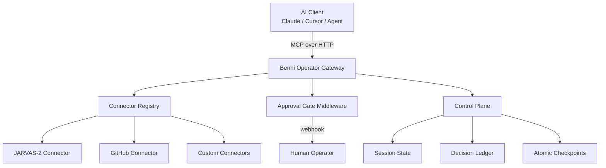

# Benni Operator Gateway

> **Open-source MCP Gateway for AI Operators** — self-host your own tool-calling infrastructure, connect any LLM to your agent stack, and enforce human-in-the-loop approval gates before any sensitive action executes.

[](LICENSE)
[](https://www.typescriptlang.org/)
[](https://nodejs.org/)
[](CONTRIBUTING.md)
[](https://modelcontextprotocol.io/)

---

## Overview

**Benni Operator Gateway** is the open-source foundation of the **Benni OS** ecosystem — a production-grade HTTP gateway that implements the [Model Context Protocol (MCP)](https://modelcontextprotocol.io/), purpose-built for autonomous AI operators.

It gives any MCP-compatible client (Claude Desktop, Cursor, custom agents, CI pipelines) a single, secure, extensible interface to interact with your tools, services, and data — without giving up control or relying on third-party managed APIs.

```
┌──────────────────────────────────────────────────────────┐
│                     AI Client Layer                      │
│         Claude · Cursor · Custom Agent · Pipeline        │
└─────────────────────────┬────────────────────────────────┘
                          │  MCP over HTTP
┌─────────────────────────▼────────────────────────────────┐
│               Benni Operator Gateway                     │
│                                                          │
│  ┌──────────────┐  ┌────────────────┐  ┌─────────────┐  │
│  │  Connector   │  │  Approval Gate │  │   Control   │  │
│  │  Registry   │  │   Middleware   │  │    Plane    │  │
│  │ (hot-reload) │  │  (human-loop)  │  │   (state)   │  │
│  └──────┬───────┘  └───────┬────────┘  └──────┬──────┘  │
│         │                  │                  │          │
└─────────┼──────────────────┼──────────────────┼──────────┘
          │                  │                  │
    ┌─────▼──────┐    ┌──────▼──────┐    ┌──────▼──────┐
    │  Connectors│    │   Human     │    │  Session    │
    │ (JARVAS-2, │    │  Operator   │    │  State /    │
    │  GitHub,   │    │  Webhook    │    │  Ledger     │
    │  Custom)   │    └─────────────┘    └─────────────┘
    └────────────┘
```

---

## Why Benni Operator Gateway?

Most managed tool-calling APIs give you convenience at the cost of control. When you're running autonomous agents in production — agents that write code, manage infrastructure, publish content, interact with APIs — **you need a gate, not a rubber stamp.**

This gateway solves that:

| Problem | What the Gateway Does |
|---|---|
| No visibility into what tools agents call | Decision Ledger logs every tool dispatch with full context |
| Sensitive actions execute without approval | Approval Gate intercepts and waits for human confirmation |
| Adding new connectors requires downtime | Hot-reload registry registers new connectors live |
| Tight coupling to a single LLM provider | Provider-agnostic — route to any LLM behind the same interface |
| No session continuity between agent runs | Control Plane persists session state and atomic checkpoints |

---

## Architecture



---

## Quick Start

```bash
# 1. Clone
git clone https://github.com/benni-os/benni-operator-gateway
cd benni-operator-gateway

# 2. Install
npm install

# 3. Configure
cp .env.example .env
# Edit .env with your API keys and webhook URLs

# 4. Run (development)
npm run dev

# 4b. Run (production)
npm run build && npm start
```

Your MCP gateway is live at `http://localhost:3000`.

Point any MCP-compatible client to `http://localhost:3000/mcp` and start calling tools.

---

## Built-in Connectors

| Connector | Status | Description |
|---|---|---|
| `jarvas2` | ✅ Stable | Connector for the JARVAS-2 agent runtime — dispatch tasks, queue jobs, set objectives, and read operational memory. Requires a running JARVAS-2 instance. |
| `github` | ✅ Stable | Full GitHub API surface via MCP — issues, PRs, code search, reviews, branch management, and secret scanning. |
| `control-plane` | 🔧 Beta | Gateway-native session state, atomic checkpoints, and decision ledger. No external dependency required. |

> **Note on JARVAS-2 and Benni Control Plane:** The `jarvas2` connector exposes the public API surface of JARVAS-2, which is a proprietary autonomous agent runtime developed under the Benni OS brand. Similarly, Benni Control Plane is a premium Benni OS product. The open-source gateway is fully functional as a standalone MCP gateway and does not require either product to operate — you can connect it to any agent backend or build your own connector.

---

## Project Structure

```
src/
├── app.ts               # Server bootstrap
├── index.ts             # Entrypoint
├── config/              # Environment & provider config
├── connectors/          # MCP connector modules
│   ├── jarvas2/         # JARVAS-2 connector (requires external runtime)
│   └── github/          # GitHub MCP connector
├── lib/                 # Core utilities
├── middleware/          # Auth, approval gate, rate limiting
├── registry/            # Hot-reload connector registry
├── routes/              # HTTP endpoints
├── services/            # LLM dispatch, session management
└── types/               # TypeScript contracts
```

---

## Approval Gate

The gateway includes a built-in **human-in-the-loop middleware** that intercepts any tool call marked as sensitive before it executes. The agent pauses, your webhook fires, and nothing proceeds until you explicitly approve or reject.

```typescript
// Any tool with requires_approval: true triggers this flow.
// The agent is held in a pending state until a response is received.

{
  "action": "deploy_to_production",
  "reason": "Agent requested deployment after build passed",
  "payload": { ... },
  "approve_url": "https://your-gateway/approve/req_abc123",
  "reject_url":  "https://your-gateway/reject/req_abc123"
}
```

This pattern — **pause, notify, resume** — is the core safety primitive that makes it viable to run autonomous agents against real infrastructure. No approval, no execution.

---

## Control Plane (Built-in)

The gateway ships with a lightweight, built-in Control Plane that provides:

- **Session State** — persistent key-value context scoped to an agent session
- **Decision Ledger** — append-only log of every tool dispatch, approval request, and outcome
- **Atomic Checkpoints** — snapshot session state at any point; roll back on failure

This is distinct from the **Benni Control Plane**, which is a full-featured premium product in the Benni OS ecosystem. The built-in variant here is intentionally minimal and self-contained — sufficient for most autonomous workflows, and open for community extension.

---

## Configuration

All configuration is via environment variables. Copy `.env.example` to `.env`:

```bash
# Server
PORT=3000
NODE_ENV=production

# Auth
GATEWAY_API_KEY=your_secret_key

# Approval Gate
APPROVAL_WEBHOOK_URL=https://your-endpoint/approval
APPROVAL_TIMEOUT_MS=300000  # 5 minutes

# JARVAS-2 Connector (optional — only if using JARVAS-2)
JARVAS2_API_URL=https://your-jarvas2-instance
JARVAS2_API_KEY=your_jarvas2_key

# GitHub Connector
GITHUB_TOKEN=your_github_pat
```

---

## Roadmap

- [x] MCP HTTP gateway core
- [x] JARVAS-2 connector
- [x] GitHub connector
- [x] Human approval gate
- [x] Built-in Control Plane (session state, ledger, checkpoints)
- [ ] npm package `@benni-os/operator-gateway`
- [ ] Docker image + one-click Railway / Render deploy
- [ ] Web dashboard (runs · decisions · health)
- [ ] Plugin SDK for custom connector development
- [ ] OpenTelemetry tracing integration
- [ ] Multi-tenant workspace isolation

---

## Deployment

The gateway is a standard Node.js HTTP server. Deploy anywhere:

```bash
# Docker
docker build -t benni-operator-gateway .
docker run -p 3000:3000 --env-file .env benni-operator-gateway

# Fly.io (fly.toml included)
fly deploy

# Any VPS / cloud VM
npm run build
npm start
```

---

## Contributing

Contributions are welcome — especially new connectors. See [CONTRIBUTING.md](CONTRIBUTING.md) for the full guide.

The highest-value contributions right now:
- New MCP connectors (Notion, Linear, Slack, Supabase, etc.)
- Improved approval gate delivery options (email, Telegram, SMS)
- Docker Compose + one-click deploy configurations
- Observability integrations (OpenTelemetry, Grafana)

---

## Security

- All inbound requests are authenticated via `GATEWAY_API_KEY`
- Sensitive tool calls are gated behind human approval before execution
- The Decision Ledger maintains a tamper-evident audit trail
- No tool call data is sent to any third-party service

Found a vulnerability? Open a private security advisory on GitHub.

---

## Part of Benni OS

**Benni Operator Gateway** is the open-source core of the **Benni OS** ecosystem — a suite of tools for building and operating autonomous AI systems.

Other products in the Benni OS ecosystem are proprietary and developed separately. This gateway is, and will remain, fully open source under the MIT License.

- GitHub Org: [github.com/benni-os](https://github.com/benni-os)
- Built by [Benni Alencar](https://github.com/nsfwbunny)

---

**MIT License** — use freely, build on it, contribute back.
